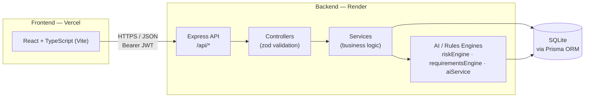

# PreClaim AI

AI-powered decision support for healthcare revenue cycle teams that predicts insurance claim denial and prior-authorization risk **before** treatment — not after the claim is rejected.

## 🚀 Live Demo

**Live application:** **[https://pre-claim-ai-delta.vercel.app](https://pre-claim-ai-delta.vercel.app/)**

The frontend above talks to the deployed backend at `https://preclaim-ai.onrender.com`. No local setup is required to try it.

**GitHub repository:** [https://github.com/sachwinraybens07/PreClaim-AI](https://github.com/sachwinraybens07/PreClaim-AI)

> Backend note: the API is hosted on Render's free tier, which spins down when idle. The first request after a period of inactivity may take up to ~50 seconds to wake the server.

## 🎯 Problem

The traditional healthcare claims workflow is reactive:

```
Treatment → Claim → Rejection → Investigation → Correction → Resubmission
```

By the time a denial is discovered, the patient has already been treated, staff time has been spent on a doomed submission, and revenue is delayed or lost. Missing documentation and unmet prior-authorization requirements are common, preventable causes of denial — but today they're usually only found after the claim fails.

## 💡 Solution

PreClaim AI flips the workflow to be proactive:

```
Planned Treatment → AI Risk Analysis → Predict Risk → Identify Gaps → Fix → Recalculate Risk → Submit
```

For each case, it predicts a denial-risk score, explains exactly why the risk exists with supporting evidence, identifies which specific documents or requirements are missing and why each one matters, and generates a prioritized action plan to close those gaps — with a "What-If" simulator to see the projected risk impact of each action before doing the work.

## ✨ Key Features

- **Claim risk analysis** — every case gets a denial-risk score (0–100), risk level (LOW/MEDIUM/HIGH/CRITICAL), confidence score, and predicted outcome, computed server-side from payer/procedure risk data, missing required documents, and historical denial patterns.
- **Explainable risk factors** — each risk contributor (missing diagnostic report, missing medical necessity documentation, prior authorization requirement, historical denial pattern for that payer/procedure) is shown with a severity, evidence string, and recommended action.
- **Document checklist generation** — the required document list is generated server-side per case from payer, procedure, and urgency (not hard-coded in the UI), with source, instructions, and rationale for each item.
- **Prevention action plan** — a prioritized, per-case list of remediation actions with status tracking (Pending / In Progress / Completed); completing an action re-runs the risk analysis automatically.
- **What-If simulator** — select candidate corrective actions and see a step-by-step projected risk trajectory, without mutating the real case data.
- **Coverage/authorization summary** — a per-case decision-support summary of coverage status, authorization status, and medical necessity documentation status.
- **PreClaim Copilot** — a case-aware chat assistant that answers questions about a specific case's risk, missing documents, and next steps.
- **Denial Intelligence** — analytics over a historical denial dataset (top denial reasons, filterable by payer/procedure/reason).
- **Dashboard** — active case count, high-risk case count, missing-document count, authorization-required count, risk distribution, and a priority case queue.
- **Authentication** — email/password sign up and sign in (bcrypt-hashed passwords), Google Sign-In, and a one-click demo login — all issuing the same JWT-based session.

No feature above is invented — each one maps directly to a controller/service in `backend/src/` and a corresponding view in `frontend/src/`.

## 🤖 AI Capabilities

PreClaim AI's "AI" is a deliberately **deterministic, explainable rules engine**, not a black-box ML model — appropriate for a decision-support tool where staff need to trust and act on *why* a score is what it is:

- **Risk engine** (`backend/src/ai/riskEngine.ts`) — combines a payer/procedure base risk (`payerData.ts`), a weighted penalty for each missing required document, and a historical-denial-pattern check (≥40% denial rate for similar payer/procedure claims) into a single risk score, risk level, confidence score, and predicted outcome.
- **Requirements engine** (`backend/src/ai/requirementsEngine.ts`) — determines which documents are required for a case based on payer, procedure, and urgency (e.g. imaging/surgical procedures require a diagnostic report and medical necessity letter; payers with `authRequired` policies require a prior authorization form).
- **Copilot abstraction** (`backend/src/ai/aiService.ts`) — an explicit integration point for an external LLM: if `LLM_API_KEY` is configured, it attempts to call an external provider; otherwise (or if that call fails) it falls back to a deterministic, case-aware response generator built from the same risk/document/action data already shown in the UI. In the current codebase, the external-LLM call path (`callExternalLLM`) is a stub that always falls back — so today's Copilot responses are generated by the deterministic engine, keyed on question intent (why is this high risk / what's missing / what to do next / prior authorization / risk reduction / summary).

## 🏗️ System Architecture



- The frontend never computes risk or hard-codes document requirements — it only renders what the API returns.
- Every mutating endpoint (analyze, document status change, action status change) re-runs the risk engine server-side, so the dashboard, case list, and case detail views stay consistent.
- The What-If simulator runs the risk engine against an in-memory hypothetical document snapshot and never mutates real case data.

See [`docs/architecture.md`](docs/architecture.md) for a full breakdown of the request flow, engines, and data model.

## 🛠️ Tech Stack

**Frontend**
- React 19, TypeScript, Vite
- Tailwind CSS
- React Router
- Recharts (charts)
- Lucide React (icons)

**Backend**
- Node.js, Express, TypeScript
- Zod (request validation)

**Database**
- SQLite
- Prisma ORM

**AI**
- Deterministic risk-scoring and document-requirements rules engines (in-house)
- Pluggable LLM abstraction for the Copilot (no external provider wired in by default)

**Authentication**
- JWT (`jsonwebtoken`)
- bcrypt password hashing (`bcryptjs`)
- Google Sign-In (`google-auth-library`)

**Deployment**
- Frontend: Vercel
- Backend: Render

## 📁 Project Structure

```
PreClaim-AI/
├── backend/
│   ├── prisma/
│   │   ├── schema.prisma       # User, Patient, Insurance, Case, Document,
│   │   │                       # RiskFactor, Action, Simulation, DenialRecord, CopilotMessage
│   │   └── seed.ts             # 12 synthetic demo cases + historical denial records
│   └── src/
│       ├── ai/                 # riskEngine, requirementsEngine, payerData, aiService (copilot)
│       ├── controllers/        # authController, caseController, documentController,
│       │                       # actionController, copilotController, dashboardController, denialController
│       ├── services/           # authService, caseService, dashboardService, denialService, copilotService
│       ├── routes/              # /api route wiring
│       ├── middleware/          # auth (JWT), error handling
│       ├── database/            # Prisma client
│       └── index.ts
├── frontend/
│   └── src/
│       ├── components/ui/       # Button, Card, Badge, ProgressBar, Skeleton, EmptyState
│       ├── components/layout/   # Sidebar, Header, AppLayout
│       ├── features/case/       # RiskHeroCard, RiskFactors, DocumentChecklist, ActionPlan,
│       │                        # WhatIfSimulator, CoverageChecker, CopilotPanel
│       ├── pages/                # Login, Dashboard, Cases, NewCase, CaseAnalysis,
│       │                        # DenialIntelligence, Copilot, Settings
│       ├── hooks/                # useAuth, useToast
│       ├── services/api.ts      # centralized API client
│       └── types/
├── docs/
│   ├── architecture.md
│   ├── api.md
│   └── screenshots/
├── README.md
└── .gitignore
```

## 🔐 Authentication

PreClaim AI supports three ways to sign in, all issuing the same JWT session token (12-hour expiry, sent as `Authorization: Bearer <token>` and required on every API route except `/auth/*`):

- **Email/password sign up** (`POST /auth/signup`) — password hashed with bcrypt (`bcryptjs`) before storage; email is trimmed and lowercased so it's matched case-insensitively; duplicate emails are rejected.
- **Email/password sign in** (`POST /auth/login`) — verifies the submitted password against the stored bcrypt hash.
- **Google Sign-In** (`POST /auth/google`) — the frontend obtains a Google ID token via Google Identity Services; the backend verifies it server-side against `GOOGLE_CLIENT_ID` using `google-auth-library` and requires a verified email. **A Google email that already belongs to a password-based account is not automatically linked** — the user is asked to sign in with their password instead.
- **Demo login** — a one-click "Enter Demo" flow that logs into a fixed, seeded demo account with no credentials required.

No API response ever includes the stored password hash.

No passwords, API keys, JWT secrets, or OAuth secrets are included in this repository or this document — see [Local Development](#️-local-development) for the environment variable *names* required to run your own instance.

## ⚙️ Local Development

### Prerequisites

- Node.js 18+
- npm

### 1. Backend

```bash
cd backend
npm install
```

Create `backend/.env` with the following variables (see `backend/.env.example`):

| Variable | Purpose |
|---|---|
| `DATABASE_URL` | Prisma/SQLite connection string, e.g. `file:./dev.db` |
| `JWT_SECRET` | Secret used to sign session JWTs |
| `PORT` | Port the API listens on (defaults to `4000`) |
| `LLM_API_KEY` | Optional — enables the external-LLM path in the Copilot when set |
| `GOOGLE_CLIENT_ID` | Google OAuth client ID, required for Google Sign-In |

Set up the database and seed demo data:

```bash
npx prisma generate
npx prisma db push
npx tsx prisma/seed.ts
```

Run the backend:

```bash
npm run dev
```

The API is available at `http://localhost:4000`.

### 2. Frontend

```bash
cd frontend
npm install
```

Create `frontend/.env` with the following variables (see `frontend/.env.example`):

| Variable | Purpose |
|---|---|
| `VITE_API_URL` | Base URL of the backend API. Leave unset locally — Vite proxies `/api` to `http://localhost:4000` automatically. |
| `VITE_GOOGLE_CLIENT_ID` | Same Google OAuth client ID as the backend, required for Google Sign-In |

Run the frontend:

```bash
npm run dev
```

The app is available at `http://localhost:5173` and proxies `/api` requests to the backend on port 4000.

### 3. Demo login

Click **Enter Demo** on the login screen (creates/reuses a fixed demo user), or sign in manually with:

- Email: `sarah.chen@preclaim.ai`
- Password: `demo1234`
- 
## Deployment

PreClaim AI is deployed using a separate frontend and backend.

- **Live Application:** https://pre-claim-ai.vercel.app
- **Backend API:** https://preclaim-ai.onrender.com
- **GitHub Repository:** https://github.com/chandilyanr-star/PreClaim-AI

The production frontend communicates with the deployed backend API on Render.

This is a seeded demo account intentionally configured in `backend/src/services/authService.ts` for demo purposes — it is not a production credential.

## 🌐 Deployment

| Layer | Platform | URL |
|---|---|---|
| Frontend | Vercel | [https://pre-claim-ai.vercel.app](https://pre-claim-ai.vercel.app) |
| Backend | Render | [https://preclaim-ai.onrender.com](https://preclaim-ai.onrender.com) |

The deployed frontend is built with `VITE_API_URL` pointed at the Render backend URL above, so all API requests from the live app go to `https://preclaim-ai.onrender.com/api/*`. The backend enables CORS so it can be called from the Vercel-hosted frontend's origin.

## 🔌 API Overview

Base path: `/api`. All routes below except the three `/auth/*` routes require `Authorization: Bearer <jwt>`.

**Auth**
- `POST /auth/login` — email/password sign in, or `{ demo: true }` for demo login
- `POST /auth/signup` — create an email/password account
- `POST /auth/google` — Google ID-token sign-in/sign-up

**Cases**
- `POST /cases` — create a case (patient, insurance, generated document checklist)
- `GET /cases` — list all cases
- `GET /cases/:id` — full case detail
- `POST /cases/:id/analyze` — re-run the risk engine for a case
- `GET /cases/:id/risk` — risk fields only
- `GET /cases/:id/documents` — list a case's documents
- `POST /cases/:id/documents` — add an ad-hoc document
- `PATCH /documents/:id` — update a document's status (re-runs analysis)
- `GET /cases/:id/actions` — list a case's prevention actions
- `PATCH /actions/:id` — update an action's status (re-runs analysis)
- `POST /cases/:id/simulate` — run the What-If simulator
- `GET /cases/:id/coverage` — coverage/authorization/medical-necessity summary

**Copilot**
- `POST /cases/:id/copilot` — send a message, get the Copilot's reply
- `GET /cases/:id/copilot` — copilot message history for a case

**Dashboard**
- `GET /dashboard` — aggregated KPIs and priority case queue

**Denial Intelligence**
- `GET /denials` — historical denial analytics (optional `payer`, `procedure`, `reason` filters)

Full request/response shapes are documented in [`docs/api.md`](docs/api.md).

## 🎬 Demo

**Try it live:** **[https://pre-claim-ai.vercel.app](https://pre-claim-ai.vercel.app)**

Suggested golden-path walkthrough:

1. Click **Enter Demo** on the login screen → **Dashboard**.
2. Open the highest-risk case in the priority queue.
3. Review the risk score, risk level, and predicted outcome, then expand the risk factors to see why the score is what it is.
4. Review the document checklist and prevention action plan.
5. Open **What-If?**, select corrective actions, and see the projected risk drop.
6. Ask **PreClaim Copilot** a question about the case (e.g. "Why is this case high risk?" or "What should I do next?").
7. Review **Denial Intelligence** for historical denial patterns across payers/procedures.

## 🔮 Future Improvements

The current risk model is a transparent, deterministic rules engine (not a trained ML model) by design — it's explainable and reliable for a live demo. Realistic next steps beyond the current MVP:

- Real payer API/portal integrations for live authorization status, rather than a static, deterministic payer/procedure risk profile.
- Document upload and OCR to verify the actual content of required documents, rather than tracking document status as metadata.
- A trained ML risk model informed by real historical claims data, with the current rules engine retained as an explainable baseline/fallback.
- Wiring the existing `LLM_API_KEY` integration point (`callExternalLLM` in `aiService.ts`) to a real LLM provider.
- Role-based permissions and multi-facility support.
- Real-time collaborative case notes and an audit trail.

**Current scope note:** this is a hackathon build using synthetic demo data only — no real patient information is stored or processed. Predictions are decision support and are explicitly labeled as estimates that do not replace payer verification; this is not a HIPAA-compliant production system.

## 👥 Team
Sachwin Raybens S - DEVOLOPER (BOTH FRONT AND BACKEND)-sachwinraybens07
Sanjith SR - DEBUGER - 
Chandilyan R - DEBUGER - chandilyanr-star
Akileasshh KPB - PRESENTER - 

Team information was not present in the original project README. Add your team's names/roles here.

## 📄 License

No license file is currently included in this repository. All rights reserved by the project authors unless a license is added.
